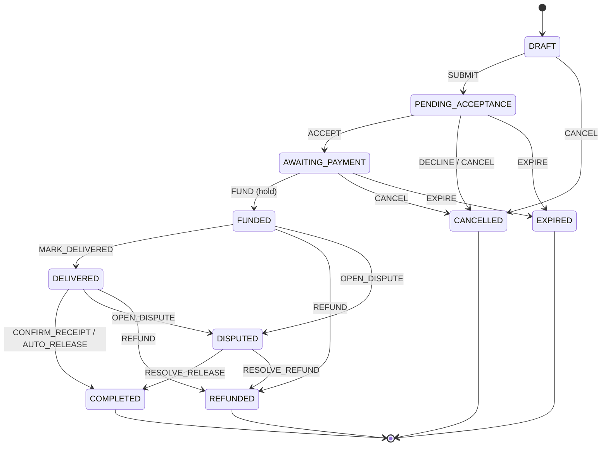

# Deal (escrow transaction) states

Source of truth: `apps/api/app/domain/deal_states.py`. Only the backend may
change a deal's state; clients request *actions*. Each transition lists which
actor may perform it and which simulated ledger posting must be written in the
**same** database transaction.

| From | Action | To | Who | Ledger effect |
|---|---|---|---|---|
| DRAFT | SUBMIT | PENDING_ACCEPTANCE | buyer, seller | – |
| DRAFT | CANCEL | CANCELLED | buyer, seller | – |
| PENDING_ACCEPTANCE | ACCEPT | AWAITING_PAYMENT | buyer, seller (the counterparty) | – |
| PENDING_ACCEPTANCE | DECLINE / CANCEL | CANCELLED | buyer, seller | – |
| PENDING_ACCEPTANCE | EXPIRE | EXPIRED | system | – |
| AWAITING_PAYMENT | FUND | FUNDED | buyer | **hold in escrow** |
| AWAITING_PAYMENT | CANCEL | CANCELLED | buyer, seller | – |
| AWAITING_PAYMENT | EXPIRE | EXPIRED | system | – |
| FUNDED | MARK_DELIVERED | DELIVERED | seller | – |
| FUNDED | REFUND | REFUNDED | seller, admin | **refund to buyer** |
| FUNDED | OPEN_DISPUTE | DISPUTED | buyer, seller | – |
| DELIVERED | CONFIRM_RECEIPT | COMPLETED | buyer | **release to seller** |
| DELIVERED | AUTO_RELEASE | COMPLETED | system (after the inspection window) | **release to seller** |
| DELIVERED | OPEN_DISPUTE | DISPUTED | buyer, seller | – |
| DELIVERED | REFUND | REFUNDED | seller, admin | **refund to buyer** |
| DISPUTED | RESOLVE_RELEASE | COMPLETED | admin | **release to seller** |
| DISPUTED | RESOLVE_REFUND | REFUNDED | admin | **refund to buyer** |

Terminal states: `COMPLETED`, `REFUNDED`, `CANCELLED`, `EXPIRED`.
Escrow-held states: `FUNDED`, `DELIVERED`, `DISPUTED`.

Properties verified by `tests/unit/test_deal_states.py`:

* every state is reachable from `DRAFT`, and terminal states have no exits;
* money moves **exactly** when a deal enters or leaves an escrow-held state;
* only the buyer can fund or confirm receipt; the buyer can never refund to
  themself; nobody can `CANCEL` a funded deal (only refund or dispute);
* only an admin can resolve a dispute.

Open design questions for Phase 1 and later (not implemented): who may `SUBMIT` vs.
`ACCEPT` (initiator vs. counterparty), the inspection-window length for
`AUTO_RELEASE`, partial refunds and split dispute outcomes, and fees.

## Mongolian labels (UI)

| Status | Label |
|---|---|
| DRAFT | Ноорог |
| PENDING_ACCEPTANCE | Зөвшөөрөл хүлээж буй |
| AWAITING_PAYMENT | Төлбөр хүлээж буй |
| FUNDED | Барьцаанд байршсан |
| DELIVERED | Хүргэгдсэн |
| COMPLETED | Амжилттай дууссан |
| DISPUTED | Маргаантай |
| REFUNDED | Буцаан олгосон |
| CANCELLED | Цуцлагдсан |
| EXPIRED | Хугацаа дууссан |
